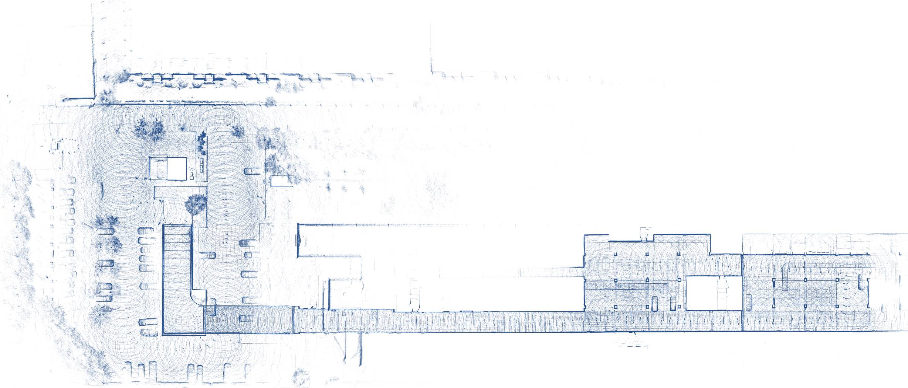
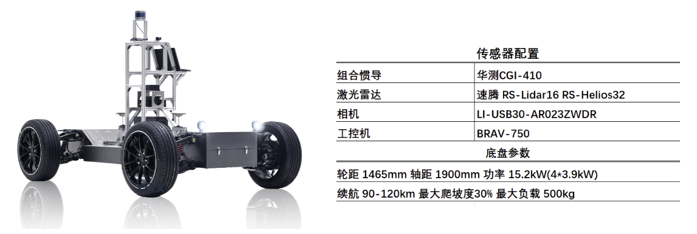
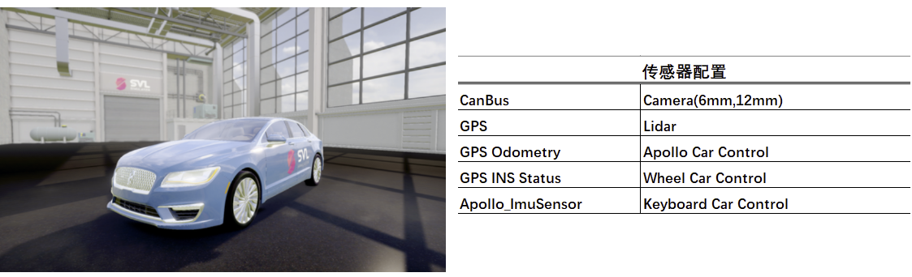
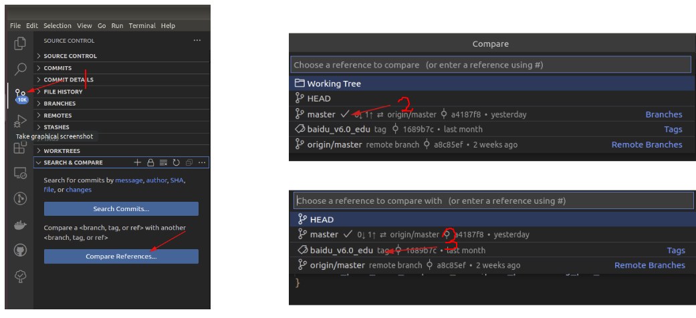
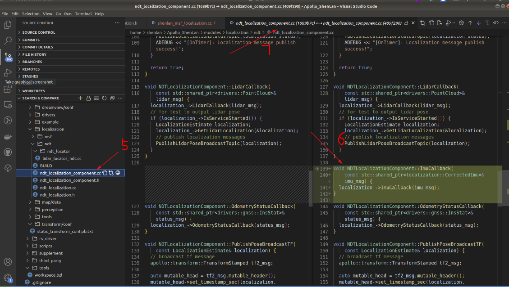

## 深蓝学院Apollo版本更新

### 深蓝多传感器融合定位

基于深蓝[多传感器融合定位](https://www.shenlanxueyuan.com/course/558)课程配套代码，优化了激光雷达+GNSS+IMU+轮速计的融合模式，将其代码移植至百度Apollo([v6.0_edu](https://github.com/ApolloAuto/apollo/tree/v6.0_edu))自动驾驶系统中，在车端完成融合定位算法的验证，同感知、规控等单元共同实现车端的自动驾驶功能。课程以线上仿真＋线下实车测试的方式进行，旨在帮助同学理论结合实践，在实际环境中对各匹配及融合算法进行测试，了解各算法优劣，并针对部分退化场景利用多传感器融合的方式保证车端定位结果的可靠性。

- 实车Apollo代码： https://github.com/shenlan2017/Apollo_ShenLan 
- LGSVL仿真器下载地址： https://github.com/shenlan2017/ShenLanSVL
- Apollo&LGSVL联合仿真： https://www.shenlanxueyuan.com/course/563

多传感器定位算法实现代码可定位至`/Apollo_ShenLan/modules/localization/shenlan_msf`进行学习。

上图地点为北京腾讯众创空间东侧地上、地下停车场场景测试结果，涵盖无GPS、激光退化等场景。

#### 适配车辆

- 实车**Pix Hooke** 

车辆配置文件文件位置：`/home/shenlan/Apollo_ShenLan/modules/calibration/data/dev_kit_pix_hooke`

- 仿真车辆 **林肯MKZ**

车辆配置文件文件位置：`/home/shenlan/Apollo_ShenLan/modules/calibration/data/Lincoln2017MKZ`

**补充：**

本课程代码基于百度Apollo([v6.0_edu](https://github.com/ApolloAuto/apollo/tree/v6.0_edu))进行迭代开发，除将深蓝学院[多传感器融合定位](https://www.shenlanxueyuan.com/course/558)课程配套代码嵌入至Apollo定位模块中,还对其驱动、定位、感知单元做了部分调整：

- 车辆配置

  - 添加深蓝学院`Hooke`以及LGSVL仿真车辆`林肯MKZ`这两款车型。

  - 文件目录：`/Apollo_ShenLan/modules/calibration/data/*`

- 第三方库：

  - 添加速腾`RS-Helios`32线激光雷达驱动，引入至thirdparty
  - 添加G2O, ceres , Sophus 等SHENLAN 多传感器融合定位所依赖的第三方库
  - 文件目录：`/Apollo_ShenLan/third_party `，` /Apollo_ShenLan/rs_driver`

- 定位  

  - NDT定位模块
    - 定位模块中添加IMU话题消息的接收，同NDT模块定位结果一同发布至`/apollo/localization/pose`中，提供给下游PNC模块。
    - 修复Eigen内存对齐问题
    - 更改线性差值方法
  - SHENLAN多传感器融合定位模块
  - 文件目录：`/Apollo_ShenLan/modules/localization/*`

- 感知

  - 修复感知程序bug， 添加交通灯、车道线、障碍物的可视化窗口 
  - 障碍物剔除：增加利用感知单元的障碍物检测算法（CnnSegmetation、PointPillar）对建图过程的障碍物进行剔除
  - 文件目录：`/Apollo_ShenLan/modules/perception`

  

> 对于ShenLan Apollo 同 Apollo v6.0_edu版本的具体代码差异，可通过VS Code进行版本的差异化对比

​                                                           

