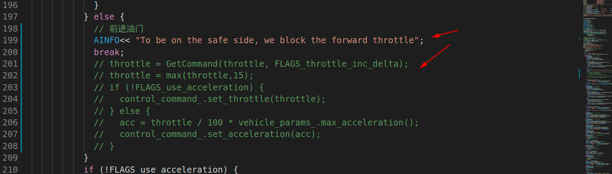
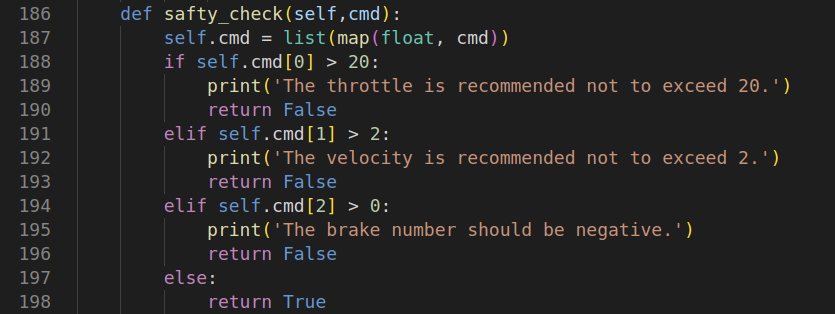

# 1. 键盘控车程序修改
思路：直接将油门指令屏蔽
用法：用`teleop.cc`替换`/apollo/modules/canbus/tools/teleop.cc`，执行`bash apollo.sh build_opt canbus`，运行`./scripts/canbus_teleop.sh`

# 2. 油门刹车标定程序修改
思路：在data_collector.py文件中增加安全检测函数，即油门小于20%，速度小于2m/s，制动小于0
用法：用`data_collector.py`替换`/apollo/modules/tools/vehicle_calibration/data_collector.py`，运行`./bazel-bin/modules/tools/vehicle_calibration/data_collector`

